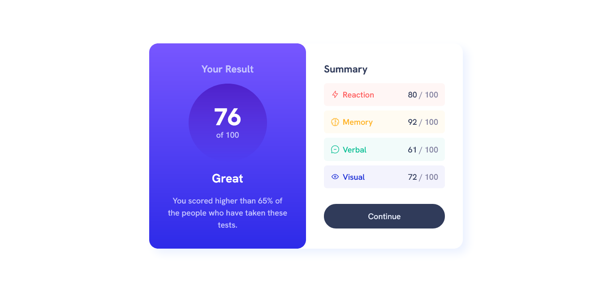

# Frontend Mentor - Results summary component solution

This is a solution to the [Results summary component challenge on Frontend Mentor](https://www.frontendmentor.io/challenges/results-summary-component-CE_K6s0maV).

**Live Site URL: [Add live site URL here](https://your-live-site-url.com)**

## Overview

### The challenge

Users should be able to:

- View the optimal layout for the interface depending on their device's screen size
- See hover and focus states for all interactive elements on the page

---

### Screenshot

## My process

### Built with

- Semantic HTML5 markup
- CSS custom properties
- CSS Grid
- Media queries
- [CSS Reset (reset.css) by Josh W Comeau](https://www.joshwcomeau.com/css/custom-css-reset/)
- A tinchy bit of JavaScript

---

### What I learned:

Media queries are finnicky.

---

### Useful resources

- [Codecademy](https://www.codecademy.com)
- [Kevin Powell](https://www.youtube.com/@KevinPowell)

---

## Author

- Website - [Add your name here](https://www.your-site.com)
- Frontend Mentor - [@joshbraham](https://www.frontendmentor.io/profile/joshbraham)
